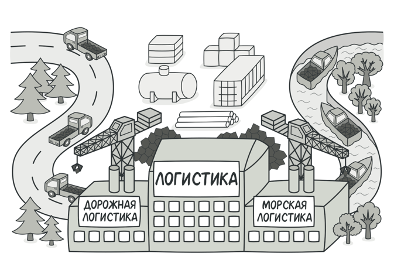
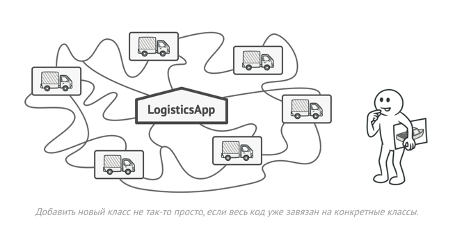
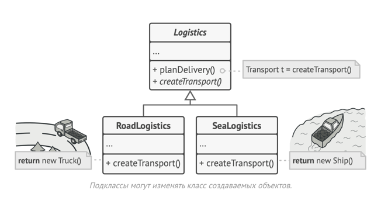
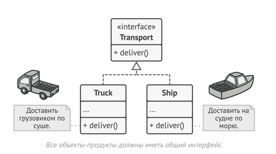
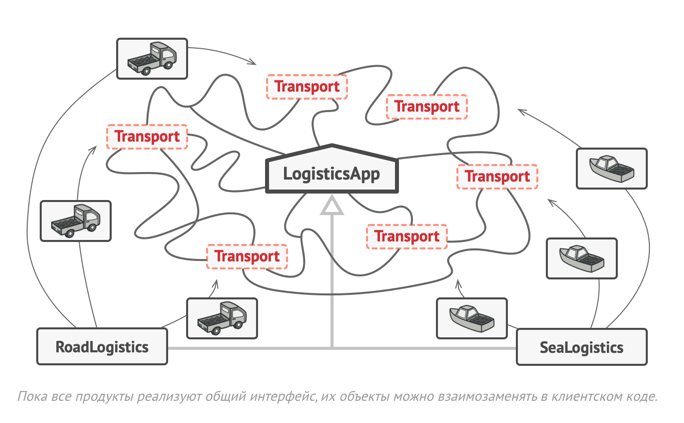
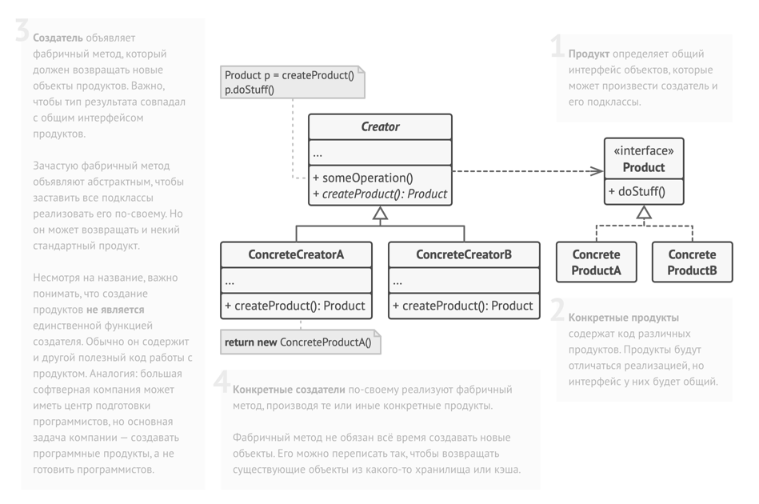

# Суть паттерна
Фабричный метод — это порождающий паттерн проектирования, который определяет общий интерфейс для создания объектов в суперклассе, позволяя подклассам изменять тип создаваемых объектов.

# Проблема
Представьте, что вы создаёте программу управления грузовыми перевозками. Сперва вы рассчитываете перевозить товары только на автомобилях. Поэтому весь ваш код работает с объектами класса Грузовик.

В какой-то момент ваша программа становится настолько известной, что морские перевозчики выстраиваются в очередь и просят добавить поддержку морской логистики в программу.

Отличные новости, правда?! Но как насчёт кода? Большая часть существующего кода жёстко привязана к классам Грузовиков. Чтобы добавить в программу классы морских Судов, понадобится перелопатить всю программу. Более того, если вы потом решите добавить в программу ещё один вид транспорта, то всю эту работу придётся повторить.

В итоге вы получите ужасающий код, наполненный условными операторами, которые выполняют то или иное действие, в зависимости от класса транспорта.

# Решение
Паттерн Фабричный метод предлагает создавать объекты не напрямую, используя оператор new, а через вызов особого фабричного метода. Не пугайтесь, объекты всё равно будут создаваться при помощи new, но делать это будет фабричный метод.

На первый взгляд, это может показаться бессмысленным: мы просто переместили вызов конструктора из одного конца программы в другой. Но теперь вы сможете переопределить фабричный метод в подклассе, чтобы изменить тип создаваемого продукта.

Чтобы эта система заработала, все возвращаемые объекты должны иметь общий интерфейс. Подклассы смогут производить объекты различных классов, следующих одному и тому же интерфейсу.

Например, классы Грузовик и Судно реализуют интерфейс Транспорт с методом доставить. Каждый из этих классов реализует метод по-своему: грузовики везут грузы по земле, а суда — по морю. Фабричный метод в классе ДорожнойЛогистики вернёт объект-грузовик, а класс МорскойЛогистики — объект-судно.

Для клиента фабричного метода нет разницы между этими объектами, так как он будет трактовать их как некий абстрактный Транспорт. Для него будет важно, чтобы объект имел метод доставить, а как конкретно он работает — не важно.

# Структура

# Применимость
## Когда заранее неизвестны типы и зависимости объектов, с которыми должен работать ваш код. ##
Фабричный метод отделяет код производства продуктов от остального кода, который эти продукты использует.\
Благодаря этому, код производства можно расширять, не трогая основной. Так, чтобы добавить поддержку нового продукта, вам нужно создать новый подкласс и определить в нём фабричный метод, возвращая оттуда экземпляр нового продукта.

## Когда вы хотите дать возможность пользователям расширять части вашего фреймворка или библиотеки. ##
Пользователи могут расширять классы вашего фреймворка через наследование. Но как сделать так, чтобы фреймворк создавал объекты из этих новых классов, а не из стандартных?

Решением будет дать пользователям возможность расширять не только желаемые компоненты, но и классы, которые создают эти компоненты. А для этого создающие классы должны иметь конкретные создающие методы, которые можно определить.

Например, вы используете готовый UI-фреймворк для своего приложения. Но вот беда — требуется иметь круглые кнопки, вместо стандартных прямоугольных. Вы создаёте класс RoundButton. Но как сказать главному классу фреймворка UIFramework, чтобы он теперь создавал круглые кнопки, вместо стандартных?

Для этого вы создаёте подкласс UIWithRoundButtons из базового класса фреймворка, переопределяете в нём метод создания кнопки (а-ля createButton) и вписываете туда создание своего класса кнопок. Затем используете UIWithRoundButtons вместо стандартного UIFramework.

## Когда вы хотите экономить системные ресурсы, повторно используя уже созданные объекты, вместо порождения новых. ##
Такая проблема обычно возникает при работе с тяжёлыми ресурсоёмкими объектами, такими, как подключение к базе данных, файловой системе и т. д.

Представьте, сколько действий вам нужно совершить, чтобы повторно использовать существующие объекты:\
    1. Сначала вам следует создать общее хранилище, чтобы хранить в нём все создаваемые объекты.\
    2. При запросе нового объекта нужно будет заглянуть в хранилище и проверить, есть ли там неиспользуемый объект.\
    3. А затем вернуть его клиентскому коду.\
    4. Но если свободных объектов нет — создать новый, не забыв добавить его в хранилище.

Весь этот код нужно куда-то поместить, чтобы не засорять клиентский код.

Самым удобным местом был бы конструктор объекта, ведь все эти проверки нужны только при создании объектов. Но, увы, конструктор всегда создаёт новые объекты, он не может вернуть существующий экземпляр.

Значит, нужен другой метод, который бы отдавал как существующие, так и новые объекты. Им и станет фабричный метод.

# Шаги реализации
1. Приведите все создаваемые продукты к общему интерфейсу.
2. В классе, который производит продукты, создайте пустой фабричный метод. В качестве возвращаемого типа укажите общий интерфейс продукта.
3. Затем пройдитесь по коду класса и найдите все участки, создающие продукты. Поочерёдно замените эти участки вызовами фабричного метода, перенося в него код создания различных продуктов.\
    В фабричный метод, возможно, придётся добавить несколько параметров, контролирующих, какой из продуктов нужно создать.\
    На этом этапе фабричный метод, скорее всего, будет выглядеть удручающе. В нём будет жить большой условный оператор, выбирающий класс создаваемого продукта. Но не волнуйтесь, мы вот-вот исправим это.
4. Для каждого типа продуктов заведите подкласс и переопределите в нём фабричный метод. Переместите туда код создания соответствующего продукта из суперкласса.
5. Если создаваемых продуктов слишком много для существующих подклассов создателя, вы можете подумать о введении параметров в фабричный метод, которые позволят возвращать различные продукты в пределах одного подкласса.
    Например, у вас есть класс Почта с подклассами АвиаПочта и НаземнаяПочта, а также классы продуктов Самолёт, Грузовик и Поезд. Авиа соответствует Самолётам, но для НаземнойПочты есть сразу два продукта. Вы могли бы создать новый подкласс почты для поездов, но проблему можно решить и по-другому. Клиентский код может передавать в фабричный метод НаземнойПочты аргумент, контролирующий тип создаваемого продукта.
6. Если после всех перемещений фабричный метод стал пустым, можете сделать его абстрактным. Если в нём что-то осталось — не беда, это будет его реализацией по умолчанию.

# Преимущества и недостатки
| Преимущества                                                                | Недостатки                                                                                                                                   |
|-----------------------------------------------------------------------------|----------------------------------------------------------------------------------------------------------------------------------------------|
| ✅ Избавляет класс от привязки к конкретным классам продуктов.               | ❌ Может привести к созданию больших параллельных иерархий классов, так как для каждого класса продукта надо создать свой подкласс создателя. |
| ✅ Выделяет код производства продуктов в одно место, упрощая поддержку кода. |                                                                                                                                              |
| ✅ Упрощает добавление новых продуктов в программу.                          |                                                                                                                                              |
| ✅ Реализует принцип открытости/закрытости.                                  |                                                                                                                                              |

# Отношения с другими паттернами
* Многие архитектуры начинаются с применения Фабричного метода (более простого и расширяемого через подклассы) и эволюционируют в сторону Абстрактной фабрики, Прототипа или Строителя (более гибких, но и более сложных).
* Классы Абстрактной фабрики чаще всего реализуются с помощью Фабричного метода, хотя они могут быть построены и на основе Прототипа.
* Фабричный метод можно использовать вместе с Итератором, чтобы подклассы коллекций могли создавать подходящие им итераторы.
* Прототип не опирается на наследование, но ему нужна сложная операция инициализации. Фабричный метод, наоборот, построен на наследовании, но не требует сложной инициализации.
* Фабричный метод можно рассматривать как частный случай Шаблонного метода. Кроме того, Фабричный метод нередко бывает частью большого класса с Шаблонными методами.
