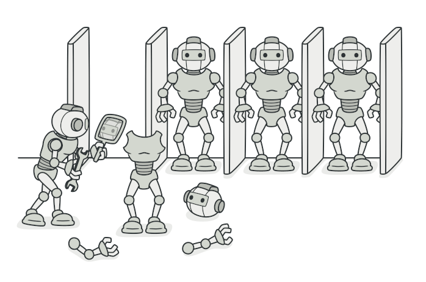
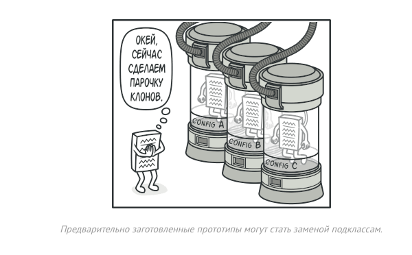
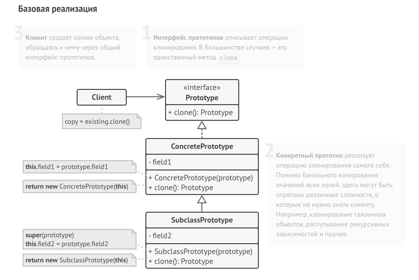
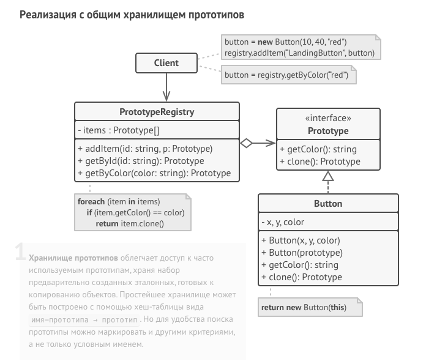

# Суть паттерна
Прототип — это порождающий паттерн проектирования, который позволяет копировать объекты, не вдаваясь в подробности их реализации.

# Проблема
У вас есть объект, который нужно скопировать. Как это сделать? Нужно создать пустой объект такого же класса, а затем поочерёдно скопировать значения всех полей из старого объекта в новый.\
Прекрасно! Но есть нюанс. Не каждый объект удастся скопировать таким образом, ведь часть его состояния может быть приватной, а значит — недоступной для остального кода программы.

Но есть и другая проблема. Копирующий код станет зависим от классов копируемых объектов. Ведь, чтобы перебрать все поля объекта, нужно привязаться к его классу. Из-за этого вы не сможете копировать объекты, зная только их интерфейсы, а не конкретные классы.

# Решение
Паттерн Прототип поручает создание копий самим копируемым объектам. Он вводит общий интерфейс для всех объектов, поддерживающих клонирование. Это позволяет копировать объекты, не привязываясь к их конкретным классам. Обычно такой интерфейс имеет всего один метод clone.\
Реализация этого метода в разных классах очень схожа. Метод создаёт новый объект текущего класса и копирует в него значения всех полей собственного объекта. Так получится скопировать даже приватные поля, так как большинство языков программирования разрешает доступ к приватным полям любого объекта текущего класса.\
Объект, который копируют, называется прототипом (откуда и название паттерна). Когда объекты программы содержат сотни полей и тысячи возможных конфигураций, прототипы могут служить своеобразной альтернативой созданию подклассов.

В этом случае все возможные прототипы заготавливаются и настраиваются на этапе инициализации программы. Потом, когда программе нужен новый объект, она создаёт копию из приготовленного прототипа.

# Аналогия из жизни
В промышленном производстве прототипы создаются перед основной партией продуктов для проведения всевозможных испытаний. При этом прототип не участвует в последующем производстве, отыгрывая пассивную роль.

Прототип на производстве не делает копию самого себя, поэтому более близкий пример паттерна — деление клеток. После митозного деления клеток образуются две совершенно идентичные клетки. Оригинальная клетка отыгрывает роль прототипа, принимая активное участие в создании нового объекта.

# Структура

# Применимость
## Когда ваш код не должен зависеть от классов копируемых объектов. ##
    Такое часто бывает, если ваш код работает с объектами, поданными извне через какой-то общий интерфейс. Вы не можете привязаться к их классам, даже если бы хотели, поскольку их конкретные классы неизвестны.\
    Паттерн прототип предоставляет клиенту общий интерфейс для работы со всеми прототипами. Клиенту не нужно зависеть от всех классов копируемых объектов, а только от интерфейса клонирования.

## Когда вы имеете уйму подклассов, которые отличаются начальными значениями полей. Кто-то мог создать все эти классы, чтобы иметь возможность легко порождать объекты с определённой конфигурацией. ##
    Паттерн прототип предлагает использовать набор прототипов, вместо создания подклассов для описания популярных конфигураций объектов.\
    Таким образом, вместо порождения объектов из подклассов, вы будете копировать существующие объекты-прототипы, в которых уже настроено внутреннее состояние. Это позволит избежать взрывного роста количества классов в программе и уменьшить её сложность.

# Шаги реализации
1. Создайте интерфейс прототипов с единственным методом clone. Если у вас уже есть иерархия продуктов, метод клонирования можно объявить непосредственно в каждом из её классов.
2. Добавьте в классы будущих прототипов альтернативный конструктор, принимающий в качестве аргумента объект текущего класса. Этот конструктор должен скопировать из поданного объекта значения всех полей, объявленных в рамках текущего класса, а затем передать выполнение родительскому конструктору, чтобы тот позаботился о полях, объявленных в суперклассе.
     Если ваш язык программирования не поддерживает перегрузку методов, то вам не удастся создать несколько версий конструктора. В этом случае копирование значений можно проводить и в другом методе, специально созданном для этих целей. Конструктор удобнее тем, что позволяет клонировать объект за один вызов.
3. Метод клонирования обычно состоит всего из одной строки: вызова оператора new с конструктором прототипа. Все классы, поддерживающие клонирование, должны явно определить метод clone, чтобы использовать собственный класс с оператором new. В обратном случае результатом клонирования станет объект родительского класса.
4. Опционально, создайте центральное хранилище прототипов. В нём удобно хранить вариации объектов, возможно, даже одного класса, но по-разному настроенных.\
   Вы можете разместить это хранилище либо в новом фабричном классе, либо в фабричном методе базового класса прототипов. Такой фабричный метод должен на основании входящих аргументов искать в хранилище прототипов подходящий экземпляр, а затем вызывать его метод клонирования и возвращать полученный объект.\
   Наконец, нужно избавиться от прямых вызовов конструкторов объектов, заменив их вызовами фабричного метода хранилища прототипов.

# Преимущества и недостатки
| Преимущества                                                              | Недостатки                                                                |
|---------------------------------------------------------------------------|---------------------------------------------------------------------------|
| ✅ Позволяет клонировать объекты, не привязываясь к их конкретным классам. | ❌ Сложно клонировать составные объекты, имеющие ссылки на другие объекты. |
| ✅ Меньше повторяющегося кода инициализации объектов.                      |                                                                           |
| ✅ Ускоряет создание объектов.                                             |                                                                           |
| ✅ Альтернатива созданию подклассов для конструирования сложных объектов.  |                                                                           |

# Отношения с другими паттернами
* Многие архитектуры начинаются с применения Фабричного метода (более простого и расширяемого через подклассы) и эволюционируют в сторону Абстрактной фабрики, Прототипа или Строителя (более гибких, но и более сложных).
* Классы Абстрактной фабрики чаще всего реализуются с помощью Фабричного метода, хотя они могут быть построены и на основе Прототипа.
* Если Команду нужно копировать перед вставкой в историю выполненных команд, вам может помочь Прототип.
* Архитектура, построенная на Компоновщиках и Декораторах, часто может быть улучшена за счёт внедрения Прототипа. Он позволяет клонировать сложные структуры объектов, а не собирать их заново.
* Прототип не опирается на наследование, но ему нужна сложная операция инициализации. Фабричный метод, наоборот, построен на наследовании, но не требует сложной инициализации.
* Снимок иногда можно заменить Прототипом, если объект, состояние которого требуется сохранять в истории, довольно простой, не имеет активных ссылок на внешние ресурсы либо их можно легко восстановить.
* Абстрактная фабрика, Строитель и Прототип могут быть реализованы при помощи Одиночки.